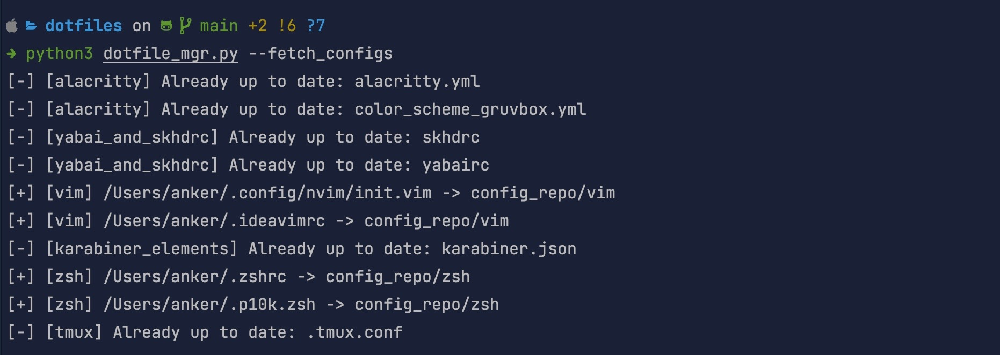
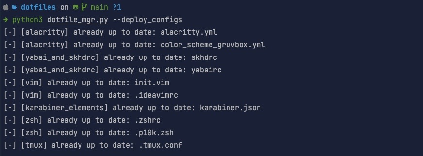

# DotfileMgr

The DotfileManager script helps users aggregate all their dotfiles into a single git
repo. It can also be used to quickly deploy the configuration files to your new systems
by automatically creating their destination directories. Copies are only made when 
files have changed, so you can safely perform your fetch/deploy commands and a status
of the files changing will be given.



## DotfileMgr Quick Notes

- Create `config_repo` directory in the root directory of DotfileMgr
- Create the config file named `dotfiles.json`, `dotfiles.yml` or `dotfiles.yaml`
- If using yaml, install yaml parser via PIP
- Run `python3 dotfile_mgr.py -h`

## DotfileMgr Install

The script is capable of running without any third party modules if you decide to create
the DotfileMgr config file in a JSON format. However, if you want to use a YAML instead,
you will need to install a YAML Python parser. You can do this with:
```bash
python3 -m venv venv
# This step will break for windows users or users running
# something like Fish. Look at the activation methods for venv
source venv/bin/activate
python3 -m pip install -r requirements.txt
```

## DotfileMgr Configuration

DotfileMgr is capable of using either a JSON file or a YAML file for your configuration. 
The configuration file **MUST** be located in the `project root directory`/config_repo
and the configuration **MUST** be named `dotfiles.json`, `dotfiles.yml` or `dotfiles.yaml`.
Both config types use the same configuration concepts. Both have a mandatory root key of `dotfiles`. 

Under the root key is a list of keys known as `deployment unit`. A `deployment unit` is 
a list of `deployment objects` where each object is a configuration for where the 
configuration came from and where the configuration is stored. 

```yaml
dotfiles:
  alacritty:
    - alacritty_conf:
        deployment_fpath: "~/.config/alacritty/alacritty.yml"
        storage_path: "${S_ROOT}"
    - alacritty_gruvbox_theme:
        deployment_fpath: "~/.config/alacritty/color_scheme_gruvbox.yml"
        storage_path: "${S_ROOT}"
```
```json
{
  "dotfiles": {
    "alacritty": [
      {
        "alacritty_conf": {
          "deployment_fpath": "~/.config/alacritty/alacritty.yml",
          "storage_path": "${S_ROOT}"
        },
        "alacritty_gruvbox_theme": {
          "deployment_fpath": "~/.config/alacritty/color_scheme_gruvbox.yml",
          "storage_path": "${S_ROOT}"
        }
      }
    ]
  }
}
```

On the two examples above you have the root key `dotfiles` followed by a single `deployment unit`
**alacritty**. This `deployment unit` has two `deployment objects` **alacritty_conf** and 
**alacritty_gruvebox_theme**.

### DotfileMgr Storage Path

The `deployment object` keys have a suffix of either `_fpath` or `_path`. The `_fpath` suffix specifies
a path to a file while `_path` specifies a directory. 

> **NOTE:** The `deployment_` key only supports `_fpath` while `storage_` supports both.

`${S_ROOT}` is an optional prefix used on the `storage_` key. When used, the prefix
is expanded to the `project_root_path` / `config_repo` / `deployment_unit_name`.

Examples:

- Using `storage_fpath: ${S_ROOT}/my_config.txt` will expand `${S_ROOT}` to the 
`deployment unit` directory and place `my_config.txt` in that directory. 
- Using 
`storage_path: ${S_ROOT}` will place the config file in the same directory with 
the name of the `deployment_fpath` file name.

`storage_path` key is used to instruct DotfileMgr to treat the path provided as a 
directory and name the storage file the same name as the `deployment_fpath` file.
